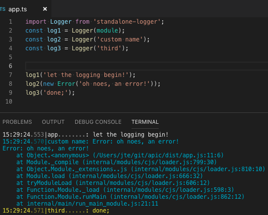

# standalone-logger
Tiny node.js logger for development logging and small server logging.

## Examples
Most simple usage:
```
const log = require('standalone-logger')(module);
log('some message');
```

More features:
```
import { Logger, loggerExpressEndpoint, LoggerSettings } from 'standalone-logger';
const log = Logger(module);

import express from 'express';
const app = express();
app.use('/logging', loggerExpressEndpoint);
app.listen(3000);
// see http://localhost:3000/logging

LoggerSettings.logfile = __dirname + '/app.log';
```


